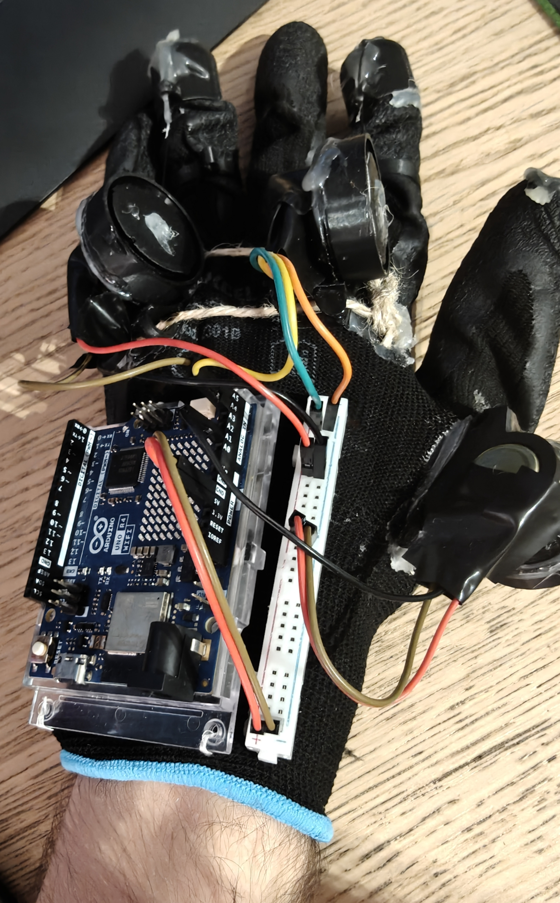

# WARNING
All of the information below was added gradually and only represents a portion of the actual story; 
For this reason what you find here might be outdated and not completely up to what we're actually doing at the moment. 
See the [Story](./story.md) section for more details. 
ALSO this website uses a summary for navigating, you can check it on your left!

# What is the "The Army" project?
The Army is a school project born out of the _HoPE_ (_Hands on Physics Experience_) initiative, proposed by our school in collaboration with the _Massachusetts Institute of Technology_ (_MIT_). The goal of the project is to develop a mechanical arm that can be remotely controlled over long distances via an internet connection through a wereable glove.

## Planning
After brainstorming basic ideas, we decided to adapt an old school project, which consisted of a simple motorized gripper, into something much more functional: a complete arm, including an elbow, entirely based on Arduino and its ecosystem. The addition of _Arduino Cloud_ allows communication between the controls and the arm, even across entire continents, and also _Smart Home_ integrations like _Alexa_ or _Google Home_.

Our six-person team divided the main tasks in:
- Communication
- 3D Modeling
- Assembly
- Programming

In every parts of the project the different teams interacted and some of them even helped the other by just for example even optimizing their codes.

## Gathering Resources for the Initial Sketch
The 3D modeling team immediately began searching for a base model to work from, finding it [here](https://www.thingiverse.com/thing:2269115). Meanwhile, the communication team researched how to use Arduino Cloud and collaborated with the programming team to transmit initial inputs through Arduino Cloud. This enabled the physical movement of servo motors provided by school funds.

## Developing the First Prototype
Using the school's 3D printer, the modeling team completed the printing of all essential parts, enabling the assembly team to begin their work. Compared to the original model, some parts were refined and modified using Blender. Notably, the last 3D-printed parts were combined to improve grip strength. 
The communication and programming teams wrote the necessary code for data transmission between two Arduinos connected via Arduino Cloud. This led to a great success of connecting the two Arduinos via Wi-Fi.

Here's the physical appearance of our proud final prototype v1 (unfortunately we couldn't finish in 8 months the palm, wrist and elbow, but they're not hard to do now that we've got the hang of it):

 

## First Tests
Besides all the test ran by the project [here](https://github.com/The-Army-Hope/Arduino-Tests) the communication and programming teams, during a school celebration event, were able to run the first tests and show it off to our professors, and it actually started working! 
The tests were simple: since at the time we didn't have long cables or breadboards we could move only one finger per time.. and the index finger worked! Across the room the two teams started moving the finger through a potentiometer. 
See the [Coding](./coding.md) section for more details.

## Next steps
Besides implmenting palm, wrist and elbow, we'll also try to make the arm itself prettier and finalize the glove that should move the arm.

## Credits
| Person                                          | Work                                                                                                                                                                                           |
| ----------------------------------------------- | ---------------------------------------------------------------------------------------------------------------------------------------------------------------------------------------------- |
| [NexIsDumb](https://github.com/NexIsDumb)       | Coding of connection between the arduinos, coding reviews, coding optimizations, website, documentation, GitHub organization stuff, helps the other members with coding optimizations and more |
| [Matte549](https://github.com/Matte549)         | Internal base code for the devices and circuits                                                                                                                                                |
| [Turkiztron](https://github.com/turkiz-jpg)     | Internal base code for the devices, 3D models of the devices, their printing and circuits                                                                                                      |
| [Tindaniel706](https://github.com/Tindaniel706) | 3D models of the devices, 3D models edits, documentation and presentation                                                                                                                      |
| Leggend                                         | Aspect side of the project while also helping the others and 3D models editing                                                                                                                 |